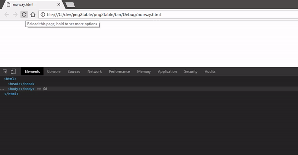
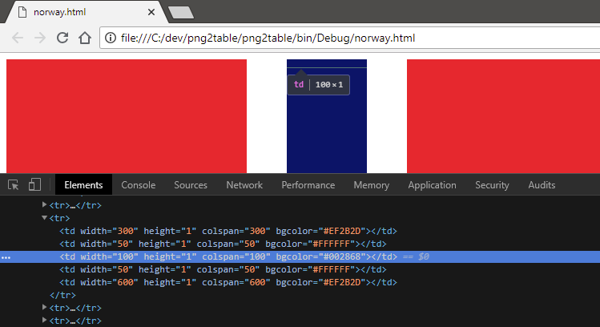

# png2table

A PoC program to convert an image to a html table tag, using td tags as pixels. Also uses the colspan atrtribute to greatly reduce html file size for some images. Initially an experiment for bypassing image blocking in email clients.

**!! png2table is just a funny PoC application, please don't use this trick to embed images in emails. !!**

## Usage

```
Usage: png2table [-nocolspan] [-st] [-noaa] [-bg html_color] image_file html_output_file

Options:
         -nocolspan              Disables use of the colspan attribute. May increase file size substantially depending on input image.
         -noaa                   Disables antialiasing, allows for transparent pixels.
         -bg html_color          Background color to use when using antialiasing. Default: white.
         -st                     Outputs a style tag for additional styling. May improve compatibility in some browsers.
```

## Examples

#### Colspan disabled:
```
> png2table.exe -nocolspan -noaa norway.png norway.html
Converting norway.png to norway.html...

Options:
Use colspan attribue: no
Use antialiasing: no
Background color: White
Use style tag: no

Input file size: 1 kb
Output file size: 44010 kb  //notice the huge file size
```



This gif shows norway.html loading in real time with the `-nocolspan` option.

***

#### Colspan enabled:
```
> png2table.exe norway.png norway.html
Converting norway.png to norway.html...

Options:
Use colspan attribue: yes
Use antialiasing: yes
Use style tag: no

Input file size: 1 kb
Output file size: 232 kb  //almost 99,5% reduction in file size
```



This shows the usage of the `colspan`-attribute and how efficient it is when the input image has many similar colors.
